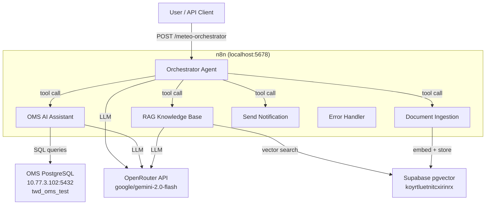

# Meteo - AI-Powered Order Management System

An AI-powered Order Management System (OMS) built with n8n, Supabase, LangChain, and OpenRouter. Features multi-agent orchestration for querying orders, inventory, fulfillment events, and a RAG-based knowledge base.

## Architecture



## Tech Stack

| Component | Technology | Details |
|-----------|-----------|---------|
| Workflow Engine | n8n (Docker) | `localhost:5678`, AI Agent nodes with LangChain.js |
| LLM Gateway | OpenRouter | `https://openrouter.ai/api/v1`, model: `google/gemini-2.0-flash` |
| Vector Store | Supabase pgvector | Project: `koyrtluetnitcxirinrx`, 1536-dim embeddings |
| OMS Database | PostgreSQL | `10.77.3.102:5432/twd_oms_test`, 4 schemas, Sequelize-managed |
| ORM | Sequelize | No FK constraints — all relationships at application level |

## Workflows

### 1. Meteo - Orchestrator Agent
**ID**: `BsfWa37nqDDYu7Sl` | **Trigger**: Webhook POST `/meteo-orchestrator`

Central routing agent that delegates requests to specialists. Accepts `{ message, sessionId?, context? }` and routes based on intent:
- Live data queries (orders, inventory, events) → OMS Assistant
- Documentation/procedures → Knowledge Base
- Adding new documents → Document Ingestion
- Alerts → Send Notification (placeholder)

Includes input validation, session-based memory (10-message window), and structured JSON responses.

### 2. Meteo - OMS AI Assistant
**ID**: `sto28rkSpvr7OGke` | **Trigger**: Chat (called as sub-workflow)

Queries the OMS PostgreSQL database across 4 schemas using 4 specialized code tools:
- **query_orders** — `"oms-order"` schema: orders, order lines, payments, fulfillment, releases (20 tables, 110 orders)
- **query_inventory** — `public` schema: stock levels, product/location masters (9.6M stock rows, 60 stores, 160K SKUs)
- **query_events** — `support` schema: workflow event log (16,896 events, 12 types, weekly partitions)
- **query_auth** — `"oms-authentication"` schema: OAuth2 users, clients, tokens (5 tables)

System prompt includes full schema documentation so the LLM generates correct SQL.

### 3. Meteo - RAG Knowledge Base
**ID**: `Vp62EHB0nSoBGiuF` | **Trigger**: Chat (called as sub-workflow)

Semantic search over embedded documents in Supabase pgvector. Uses `match_documents` RPC function with similarity threshold 0.78, returns top 5 results with source citations.

> **Setup required**: Replace the placeholder Code Tool with a Supabase Vector Store Retriever Tool node, or configure HTTP Request to call the `match_documents` RPC endpoint.

### 4. Meteo - Document Ingestion Pipeline
**ID**: `Lw3NwyIgKO4JmrZD` | **Trigger**: Webhook POST `/meteo-doc-ingest`

Accepts documents via webhook, validates content, chunks text (1000 chars / 200 overlap), and returns chunk metadata.

> **Setup required**: Add an OpenAI Embeddings node (text-embedding-3-small) and Supabase insert step to embed and store chunks in the `documents` table.

### 5. Meteo - Error Handler
**ID**: `VUqxmpY25VlNSNJv` | **Trigger**: Webhook POST `/meteo-error-handler`

Centralized error logging and notification endpoint. Receives error payloads, formats standardized error responses with severity classification and suggested actions.

## Supabase Schema (pgvector)

```sql
-- Documents table for RAG
CREATE TABLE documents (
  id UUID PRIMARY KEY DEFAULT gen_random_uuid(),
  content TEXT NOT NULL,
  metadata JSONB DEFAULT '{}',
  embedding VECTOR(1536),
  created_at TIMESTAMPTZ DEFAULT now()
);

-- HNSW index for fast similarity search
CREATE INDEX ON documents USING hnsw (embedding vector_cosine_ops);

-- Chat memory for session persistence
CREATE TABLE chat_memory (
  id UUID PRIMARY KEY DEFAULT gen_random_uuid(),
  session_id TEXT NOT NULL,
  role TEXT NOT NULL,
  content TEXT NOT NULL,
  created_at TIMESTAMPTZ DEFAULT now()
);

-- Similarity search function
CREATE FUNCTION match_documents(
  query_embedding VECTOR(1536),
  match_threshold FLOAT DEFAULT 0.78,
  match_count INT DEFAULT 5
) RETURNS TABLE (id UUID, content TEXT, metadata JSONB, similarity FLOAT)
```

## OMS Database Schemas

| Schema | Tables | Key Data |
|--------|--------|----------|
| `"oms-order"` | 20 | 110 orders, 244 order lines, 110 payments, 145 releases |
| `public` | ~1,589 | 9.6M inventory stock rows, 60 stores, 160K SKUs |
| `support` | 14 | 16,896 workflow events, 12 event types, weekly partitions |
| `"oms-authentication"` | 5 | OAuth2 users, clients, access/refresh tokens |

**Order status flow**: `Open → Allocated → Released → In Process → Picked → Fulfilled → Delivered`

## Setup Guide

### Prerequisites
- Docker Desktop
- Node.js 18+
- Supabase project (already provisioned: `koyrtluetnitcxirinrx`)
- OpenRouter API key (see `env/key.md`)

### 1. Start n8n
```bash
cd n8n
docker compose up -d
# Access at http://localhost:5678
# Owner: admin@meteo.local / MeteoAdmin2026!
```

### 2. Configure Credentials in n8n
1. **OpenRouter** (OpenAI-compatible credential):
   - Base URL: `https://openrouter.ai/api/v1`
   - API Key: from `env/key.md`
2. **OMS PostgreSQL**:
   - Host: `10.77.3.102`, Port: `5432`
   - Database: `twd_oms_test`, User: `postgres`
3. **Supabase** (for RAG workflows):
   - Project ref: `koyrtluetnitcxirinrx`

### 3. Activate Workflows (in order)
1. Meteo - Error Handler
2. Meteo - Document Ingestion Pipeline
3. Meteo - OMS AI Assistant
4. Meteo - RAG Knowledge Base
5. Meteo - Orchestrator Agent (last — depends on all others)

## Usage Examples

### Query via Orchestrator Webhook
```bash
# Ask about orders
curl -X POST http://localhost:5678/webhook/meteo-orchestrator \
  -H "Content-Type: application/json" \
  -d '{"message": "Show me the latest 5 orders", "context": "oms"}'

# Check inventory
curl -X POST http://localhost:5678/webhook/meteo-orchestrator \
  -H "Content-Type: application/json" \
  -d '{"message": "Check stock for SKU 8850999220017 at store CFR432", "context": "inventory"}'

# Search knowledge base
curl -X POST http://localhost:5678/webhook/meteo-orchestrator \
  -H "Content-Type: application/json" \
  -d '{"message": "How do I process a return?", "context": "knowledge"}'

# Ingest a document
curl -X POST http://localhost:5678/webhook/meteo-orchestrator \
  -H "Content-Type: application/json" \
  -d '{"message": "Add this SOP to the knowledge base: Returns must be processed within 48 hours of delivery..."}'
```

### Direct Error Handler
```bash
curl -X POST http://localhost:5678/webhook/meteo-error-handler \
  -H "Content-Type: application/json" \
  -d '{"error": "Connection timeout", "source": "OMS Assistant", "severity": "high"}'
```

## Project Structure

```
.
├── .claude/          # Claude Code configuration & skills
├── .mcp.json         # MCP server configuration (n8n, Supabase, Playwright, Firecrawl)
├── env/              # Environment configuration & API keys
├── n8n/              # Local n8n Docker setup
│   └── docker-compose.yml
├── reseach/          # Research documents
├── specs/            # Implementation plans
├── CLAUDE.md         # Codebase instructions for Claude Code
└── README.md         # This file
```

## Data Characteristics

- **Language**: Thai (customer names, item descriptions)
- **Products**: Grocery/FMCG (water, milk, beverages) with EAN-13 barcodes
- **UOM**: `SBOX` (box), `SBTL` (bottle)
- **Order IDs**: Prefixed patterns like `PRE_SEK-YYYYMMDD-XXXXX`, `T99-XXXXX`
- **Locations**: Prefixed like `CFR432`, `CFR581`
