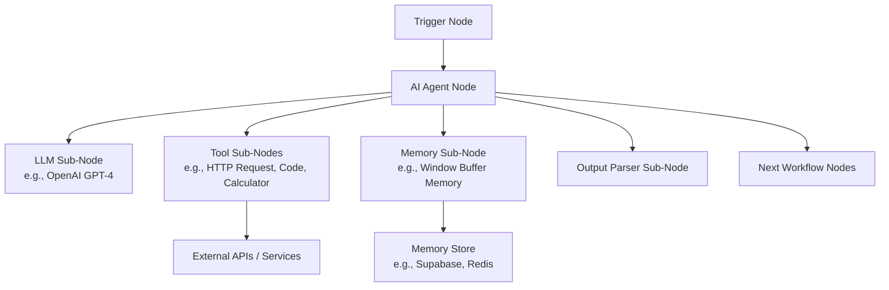
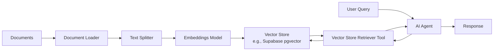
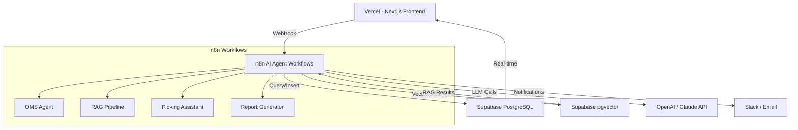

# n8n AI Agent Workflows with LangChain

> Researched on: 2026-02-07
> Research method: Parallel agent team (4 researchers)

## Overview

n8n AI Agent workflows with LangChain represent a powerful convergence of visual workflow automation and advanced AI orchestration. n8n is an open-source, self-hostable workflow automation platform that has deeply integrated LangChain — the leading framework for building LLM-powered applications — directly into its node ecosystem. This integration allows users to build sophisticated AI agent systems through a visual, low-code interface while leveraging LangChain's robust tooling for chains, agents, memory, and retrieval-augmented generation (RAG).

The core value proposition is democratizing AI agent development: rather than writing complex Python/TypeScript code to orchestrate LLM calls, tool usage, and memory management, developers and non-developers alike can visually compose AI workflows using n8n's drag-and-drop canvas. Under the hood, n8n's AI nodes are powered by LangChain, meaning users get the full power of LangChain's agent framework (ReAct agents, tool-calling agents, conversational agents) without needing to write LangChain code directly.

This combination solves several critical problems: it eliminates the steep learning curve of LangChain for non-programmers, provides visual debugging and monitoring of AI agent execution, enables rapid prototyping of complex multi-step AI workflows, and allows seamless integration of AI capabilities with 400+ existing n8n integrations (databases, APIs, messaging platforms, CRMs, etc.).

## Key Concepts

### AI Agents in n8n
An **AI Agent** in n8n is a workflow node that uses an LLM to autonomously decide which tools to call, what parameters to pass, and how to interpret results. Unlike simple chains (which follow a fixed sequence), agents dynamically choose their execution path based on the input and intermediate results. n8n supports multiple agent types:

- **Tools Agent** (default): Uses OpenAI-style function calling for structured tool invocation. Most reliable for modern LLMs.
- **ReAct Agent**: Implements the Reasoning + Acting paradigm — the LLM explicitly reasons about what to do before taking action, producing a visible thought process.
- **Conversational Agent**: Optimized for multi-turn chat interactions with memory.
- **OpenAI Functions Agent**: Specifically designed for OpenAI's function-calling API.
- **Plan and Execute Agent**: Breaks complex tasks into subtasks, plans execution order, then executes step by step.

### LangChain Integration
n8n uses **LangChain.js** (the JavaScript/TypeScript version) as its underlying AI framework. Key LangChain concepts exposed through n8n nodes:

- **Chains**: Sequential processing pipelines (e.g., Basic LLM Chain, Summarization Chain, QA Chain).
- **Tools**: External capabilities the agent can use (HTTP requests, code execution, database queries, calculators, Wikipedia, etc.).
- **Memory**: Conversation history storage (Buffer Memory, Window Buffer Memory, Zep, Motorhead, PostgreSQL chat memory).
- **Embeddings**: Vector representations of text for semantic search (OpenAI Embeddings, Cohere, HuggingFace, etc.).
- **Vector Stores**: Storage for embeddings used in RAG (Pinecone, Supabase, Qdrant, PGVector, In-Memory).
- **Document Loaders**: Ingest documents from various sources for RAG pipelines.
- **Text Splitters**: Break documents into chunks for embedding.
- **Output Parsers**: Structure LLM output into specific formats (JSON, lists, etc.).
- **Retrievers**: Fetch relevant documents from vector stores based on queries.

### Sub-Nodes (Cluster Nodes)
n8n uses a unique **sub-node** architecture for AI workflows. The main AI Agent node or Chain node acts as a "root" that connects to sub-nodes via a special connector type (not the standard workflow connections). These sub-nodes provide:
- The **LLM** (e.g., OpenAI GPT-4, Anthropic Claude, Ollama, Google Gemini)
- **Tools** the agent can call
- **Memory** for conversation persistence
- **Output parsers** for structured responses

## Architecture / How It Works

### High-Level Architecture



### Execution Flow

1. **Trigger**: A workflow is triggered (webhook, chat message, schedule, event).
2. **Input Preparation**: Data flows through standard n8n nodes for preprocessing.
3. **Agent Invocation**: The AI Agent node receives the input and passes it to the configured LLM.
4. **Tool Selection Loop** (Agent Loop):
   - The LLM analyzes the input and decides which tool(s) to call.
   - n8n executes the selected tool and returns results to the LLM.
   - The LLM processes tool results and decides if more tools are needed.
   - This loop continues until the LLM produces a final answer.
5. **Memory Update**: Conversation history is saved to the configured memory store.
6. **Output**: The agent's response flows to subsequent workflow nodes.

### Node Connection Architecture

n8n AI workflows use two types of connections:
- **Standard connections** (gray lines): Regular data flow between workflow nodes.
- **AI sub-node connections** (colored lines): Connect AI components (LLM, tools, memory) to the parent AI node. These use LangChain's internal interfaces.

### RAG (Retrieval-Augmented Generation) Architecture



## Implementation Guide

### Step 1: Set Up n8n

```bash
# Self-hosted with Docker
docker run -it --rm \
  --name n8n \
  -p 5678:5678 \
  -v n8n_data:/home/node/.n8n \
  docker.n8n.io/n8nio/n8n

# Or via npm
npm install n8n -g
n8n start
```

### Step 2: Create a Basic AI Agent Workflow

1. **Add a Trigger Node**: Start with a Chat Trigger (for interactive testing) or Webhook (for production).
2. **Add an AI Agent Node**: Drag the "AI Agent" node onto the canvas.
3. **Configure the Agent Type**: Select "Tools Agent" for most use cases.
4. **Connect an LLM**: Add an OpenAI Chat Model (or Claude, Gemini, Ollama) as a sub-node.
5. **Add Tools**: Connect tool sub-nodes (e.g., HTTP Request Tool, Calculator, Code Tool).
6. **Add Memory** (optional): Connect a memory sub-node for conversation history.
7. **Connect Output**: Link the agent output to response nodes (webhook response, Slack message, etc.).

### Step 3: Build a RAG Pipeline

1. **Ingestion Workflow** (run once or on schedule):
   - Trigger → Load Documents (from files, URLs, or APIs)
   - → Text Splitter (Recursive Character, Token-based)
   - → Embeddings (OpenAI, Cohere)
   - → Upsert to Vector Store (Supabase, Pinecone, Qdrant)

2. **Query Workflow** (user-facing):
   - Chat Trigger → AI Agent
   - Agent tools include: Vector Store Retriever Tool
   - Agent uses retriever to fetch relevant chunks → generates answer

### Step 4: Configure Sub-Agent Workflows

For complex tasks requiring multiple specialized agents:

1. **Create specialized sub-workflows**: Each sub-workflow handles a specific domain (e.g., database queries, API calls, document analysis).
2. **Use the "Call n8n Workflow" tool**: The main agent can invoke sub-workflows as tools.
3. **Orchestrator pattern**: A main agent delegates to specialist agents based on the task.

```
Main Agent (Orchestrator)
├── Tool: "Search Knowledge Base" → RAG sub-workflow
├── Tool: "Query Database" → SQL sub-workflow
├── Tool: "Send Notification" → Messaging sub-workflow
└── Tool: "Analyze Data" → Analytics sub-workflow
```

### Step 5: Add Custom Tools

You can create custom tools using the **Code Tool** node:

```javascript
// Example: Custom tool that queries a Supabase database
const { createClient } = require('@supabase/supabase-js');
const supabase = createClient(
  $env.SUPABASE_URL,
  $env.SUPABASE_KEY
);

const { data, error } = await supabase
  .from('orders')
  .select('*')
  .eq('status', $input.query);

return { json: { results: data } };
```

### Step 6: Implement Memory

For persistent conversations:

1. **Window Buffer Memory**: Keeps last N messages in context (lightweight, in-memory).
2. **Postgres Chat Memory**: Stores full conversation history in PostgreSQL/Supabase.
3. **Zep Memory**: Advanced memory with automatic summarization and entity extraction.
4. **Motorhead Memory**: Managed memory service with automatic summarization.

Configure a **session ID** to isolate conversations per user:
- Use `{{ $json.sessionId }}` or `{{ $json.userId }}` as the session key.

## Best Practices

### Design Principles

1. **Start Simple, Iterate**: Begin with a basic chain before moving to agents. Only use agents when dynamic tool selection is truly needed.
2. **Use Specific System Prompts**: Write detailed, specific system prompts that clearly define the agent's role, capabilities, constraints, and output format.
3. **Limit Tool Count**: Keep the number of tools per agent to 5-7 maximum. Too many tools confuse the LLM and increase latency/cost.
4. **Use Structured Output**: Leverage Output Parsers to ensure consistent, machine-readable responses.
5. **Implement Guardrails**: Add validation nodes after agent output to check for hallucinations, policy violations, or malformed responses.

### Error Handling

1. **Set Max Iterations**: Configure the agent's maximum iteration limit (default is often 10) to prevent infinite loops.
2. **Add Error Branches**: Use n8n's error handling to catch and gracefully handle LLM failures, tool errors, and timeouts.
3. **Implement Retry Logic**: Add retry nodes with exponential backoff for transient API failures.
4. **Log Everything**: Use n8n's execution log to monitor agent decisions, tool calls, and outputs for debugging.
5. **Fallback Responses**: Configure fallback responses when the agent fails to produce a satisfactory answer.

### Memory Management

1. **Use Window Buffer Memory** for most cases — it keeps only the last N messages, preventing context overflow.
2. **Set appropriate window sizes**: 5-10 messages is usually sufficient for conversational context.
3. **Use Postgres/Supabase memory** for production: It persists across n8n restarts and scales with your database.
4. **Clear memory strategically**: Implement session timeout logic to clear stale conversations.
5. **Summarize long conversations**: Use a summarization chain to compress older messages.

### Performance Optimization

1. **Cache embeddings**: Don't re-embed documents that haven't changed.
2. **Use streaming**: Enable streaming responses for better user experience in chat applications.
3. **Batch operations**: When ingesting documents, batch your vector store upserts.
4. **Choose the right model**: Use smaller/faster models (GPT-3.5, Claude Haiku) for simple tasks, larger models (GPT-4, Claude Opus) for complex reasoning.
5. **Minimize tool calls**: Design tools to return comprehensive results to reduce round-trips.

### Security Considerations

1. **Never expose API keys in workflows**: Use n8n credentials or environment variables.
2. **Sanitize user input**: Validate and sanitize inputs before passing to LLM prompts to prevent prompt injection.
3. **Limit tool capabilities**: Don't give agents unrestricted access to databases or file systems.
4. **Implement rate limiting**: Protect against abuse by rate-limiting AI agent endpoints.
5. **Audit trail**: Log all agent actions for compliance and debugging.

### Common Pitfalls to Avoid

| Pitfall | Solution |
|---------|----------|
| Agent enters infinite tool-calling loop | Set `maxIterations` and implement timeout |
| LLM hallucinates tool names | Use structured function calling (Tools Agent type) |
| Memory grows unbounded | Use Window Buffer Memory with appropriate size |
| Slow response times | Cache results, use streaming, optimize prompts |
| Inconsistent output format | Use Output Parsers and structured prompts |
| Token limit exceeded | Chunk inputs, summarize context, use smaller embeddings |
| Credentials exposed | Use n8n credential system, never hardcode secrets |
| Sub-workflow errors silently | Add error handling nodes in all sub-workflows |

## Tools & Technologies

### n8n AI Node Categories

| Category | Nodes | Purpose |
|----------|-------|---------|
| **Agents** | AI Agent | Core autonomous agent with tool-calling capability |
| **Chains** | Basic LLM Chain, Summarization Chain, QA Chain, Conversational Retrieval QA Chain | Fixed-sequence LLM processing |
| **LLMs** | OpenAI, Anthropic Claude, Google Gemini, Ollama, Groq, Mistral, Azure OpenAI, Cohere, HuggingFace | Language model providers |
| **Tools** | Calculator, Code, HTTP Request, SerpAPI, Wikipedia, WolframAlpha, Call n8n Workflow, Vector Store | Capabilities available to agents |
| **Memory** | Buffer Memory, Window Buffer Memory, Postgres Chat Memory, Zep, Motorhead, Redis | Conversation history storage |
| **Embeddings** | OpenAI Embeddings, Cohere, HuggingFace, Ollama, Google Vertex AI, Mistral | Text-to-vector conversion |
| **Vector Stores** | Supabase, Pinecone, Qdrant, PGVector, Chroma, Weaviate, Milvus, In-Memory | Embedding storage and retrieval |
| **Document Loaders** | Default Data Loader, Binary Input Loader, GitHub, Notion | Document ingestion |
| **Text Splitters** | Recursive Character, Token Splitter | Document chunking |
| **Output Parsers** | Auto-fixing, Structured, Item List | Format LLM output |
| **Retrievers** | Vector Store Retriever, Multi-Query Retriever, Contextual Compression | Document retrieval for RAG |

### LangChain-Specific Features in n8n

- **LangChain Expression Language (LCEL)**: n8n internally uses LCEL for composing chains, though users interact through the visual interface.
- **Callbacks**: n8n hooks into LangChain callbacks for execution logging and monitoring.
- **Custom LangChain Code**: Advanced users can use the Code node to write custom LangChain.js code within n8n workflows.
- **LangSmith Integration**: Can be configured for tracing and debugging LangChain operations.

### Key Tool Highlights

- **Call n8n Workflow Tool**: Allows an agent to invoke other n8n workflows as tools, enabling the sub-agent/orchestrator pattern.
- **Code Tool**: Execute custom JavaScript within the agent's tool-calling loop.
- **HTTP Request Tool**: Make API calls to any external service as an agent tool.
- **Vector Store Tool**: Query vector databases for RAG within the agent loop.

## Comparison & Trade-offs

### n8n vs Other AI Workflow Platforms

| Feature | n8n | Langflow | Flowise | Custom LangChain |
|---------|-----|----------|---------|-------------------|
| **Self-hostable** | Yes | Yes | Yes | N/A |
| **Open Source** | Fair-code (custom license) | Apache 2.0 | Apache 2.0 | Apache 2.0 |
| **Visual Builder** | Full workflow canvas | LangChain-focused graph | Chat-focused builder | None (code only) |
| **Non-AI Integrations** | 400+ integrations | Limited | Limited | Manual coding |
| **Agent Support** | Full (via LangChain) | Full | Full | Full |
| **Memory Options** | Extensive (7+ types) | Good | Good | Full flexibility |
| **Production Ready** | Yes (enterprise tier) | Growing | Growing | Depends on implementation |
| **Learning Curve** | Low-Medium | Medium | Low | High |
| **Customization** | High (code nodes) | High | Medium | Unlimited |
| **Community** | Large, active | Growing | Growing | Very large |
| **Pricing** | Free (self-hosted) / Cloud plans | Free (self-hosted) | Free (self-hosted) | Free (library) |

### When to Use Each Approach

- **n8n**: Best when you need AI agents integrated with broader business automation (CRM, email, databases, webhooks). Ideal for teams with mixed technical abilities.
- **Langflow**: Best for pure LangChain prototyping and experimentation. Closer to raw LangChain concepts.
- **Flowise**: Best for quickly building chatbots and simple RAG applications. Lowest barrier to entry.
- **Custom LangChain**: Best when you need maximum flexibility, custom agent logic, or integration into existing codebases.

### Trade-offs of n8n AI Agents

| Advantage | Trade-off |
|-----------|-----------|
| Visual, low-code interface | Less granular control than pure code |
| 400+ integrations | LangChain version may lag behind latest |
| Built-in execution monitoring | Performance overhead vs direct API calls |
| Self-hostable, data control | Requires infrastructure management |
| Rapid prototyping | Complex agent logic can be harder to debug visually |
| Team collaboration | Fair-code license (not fully open source) |

### Recent Developments (2025-2026)

- **n8n AI Agent node v2**: Improved agent types with better tool-calling support.
- **Enhanced streaming**: Better streaming support for chat-based AI workflows.
- **Multi-agent orchestration**: Improved patterns for sub-agent workflows using the "Call n8n Workflow" tool.
- **Expanded LLM support**: Added support for newer models including Claude 3.5/4.x, GPT-4o, Gemini 2.x.
- **Better vector store integrations**: Improved Supabase pgvector, added Qdrant and Milvus support.
- **LangChain.js updates**: n8n continuously updates its LangChain.js dependency for latest features.
- **n8n Cloud AI features**: Managed AI agent hosting with built-in monitoring and scaling.

## Relevance to Meteo Project

The Meteo project — with its OMS (Order Management System), Slick Picking Tool, and tech stack of n8n, Supabase, Vercel, and LangChain with Hexagonal Architecture — is ideally positioned to leverage n8n AI Agent workflows with LangChain. Here are specific recommendations:

### 1. OMS AI Assistant
Build an n8n AI Agent workflow that serves as an intelligent assistant for the OMS:
- **Agent Type**: Tools Agent with function calling
- **Tools**: Supabase query tool (for order lookups), HTTP Request tool (for shipping APIs), Code tool (for business logic)
- **Memory**: PostgreSQL Chat Memory via Supabase for persistent conversation history
- **Use Case**: Operators can ask natural language questions like "What orders are delayed?" or "Find all orders for customer X from last week"

### 2. RAG for Documentation & SOPs
Implement a RAG pipeline using n8n + Supabase pgvector:
- **Ingestion**: n8n workflow to load and embed OMS documentation, SOPs, and troubleshooting guides
- **Vector Store**: Supabase with pgvector extension (already in the stack)
- **Query**: AI Agent with Vector Store Retriever tool for intelligent document search
- **Use Case**: Warehouse workers using the Slick Picking Tool can get instant answers about procedures

### 3. Hexagonal Architecture Integration
The n8n AI agents can be integrated following Hexagonal Architecture principles:
- **Ports**: Define clear interfaces for AI agent interactions (chat port, query port, notification port)
- **Adapters**: n8n webhooks serve as inbound adapters; n8n HTTP Request tools serve as outbound adapters
- **Domain Logic**: Keep core business rules in Supabase functions or Vercel serverless functions; n8n agents orchestrate but don't own domain logic

### 4. Multi-Agent Orchestration for Complex Operations
Use the sub-agent pattern for complex OMS operations:
```
Main OMS Agent (Orchestrator)
├── Tool: "Order Lookup" → Supabase query sub-workflow
├── Tool: "Shipping Status" → External API sub-workflow
├── Tool: "Inventory Check" → Warehouse DB sub-workflow
├── Tool: "Generate Report" → Analytics sub-workflow
└── Tool: "Send Notification" → Slack/Email sub-workflow
```

### 5. Vercel + n8n Integration
- Deploy the chat UI on Vercel (Next.js)
- n8n handles AI agent orchestration via webhook endpoints
- Supabase provides the data layer (PostgreSQL + pgvector + Auth)
- This separation keeps the Vercel frontend lean while n8n handles complex AI workflows

### 6. Recommended Architecture for Meteo



## Sources

### Overview & Fundamentals
- [n8n AI Documentation](https://docs.n8n.io/ai/) - Official n8n AI documentation covering all AI nodes and concepts
- [n8n LangChain Integration](https://n8n.io/integrations/langchain/) - n8n's LangChain integration page
- [n8n AI Agent Node Documentation](https://docs.n8n.io/integrations/builtin/cluster-nodes/root-nodes/n8n-nodes-langchain.agent/) - Detailed AI Agent node documentation
- [Introduction to n8n Advanced AI](https://docs.n8n.io/advanced-ai/) - n8n's advanced AI introduction guide
- [n8n Blog: AI Agents](https://blog.n8n.io/ai-agents/) - Blog post on building AI agents with n8n

### Implementation & Architecture
- [n8n AI Tutorial: Build an AI Agent](https://docs.n8n.io/ai/tutorial/) - Step-by-step tutorial for building AI agents
- [n8n Sub-node Documentation](https://docs.n8n.io/integrations/builtin/cluster-nodes/) - Documentation on sub-nodes (cluster nodes)
- [n8n Workflow Templates - AI](https://n8n.io/workflows/?categories=AI) - Community workflow templates for AI use cases
- [n8n RAG Tutorial](https://docs.n8n.io/ai/rag/) - Building RAG pipelines with n8n
- [LangChain.js Documentation](https://js.langchain.com/docs/) - Official LangChain.js documentation

### Best Practices & Patterns
- [n8n AI Best Practices](https://docs.n8n.io/ai/best-practices/) - Official best practices for n8n AI workflows
- [n8n Community Forum - AI Agent Tips](https://community.n8n.io/c/ai/48) - Community discussions on AI agent patterns
- [n8n Error Handling Guide](https://docs.n8n.io/flow-logic/error-handling/) - Error handling in n8n workflows
- [LangChain Best Practices](https://python.langchain.com/docs/guides/productionization/) - LangChain production best practices

### Tools & Comparisons
- [n8n vs Langflow Comparison](https://n8n.io/compare/langflow/) - Official comparison page
- [n8n vs Flowise Comparison](https://n8n.io/compare/flowise/) - Official comparison page
- [n8n AI Nodes Reference](https://docs.n8n.io/integrations/builtin/cluster-nodes/) - Complete reference of all AI-related nodes
- [Flowise Documentation](https://docs.flowiseai.com/) - Flowise official documentation for comparison
- [Langflow Documentation](https://docs.langflow.org/) - Langflow official documentation for comparison
